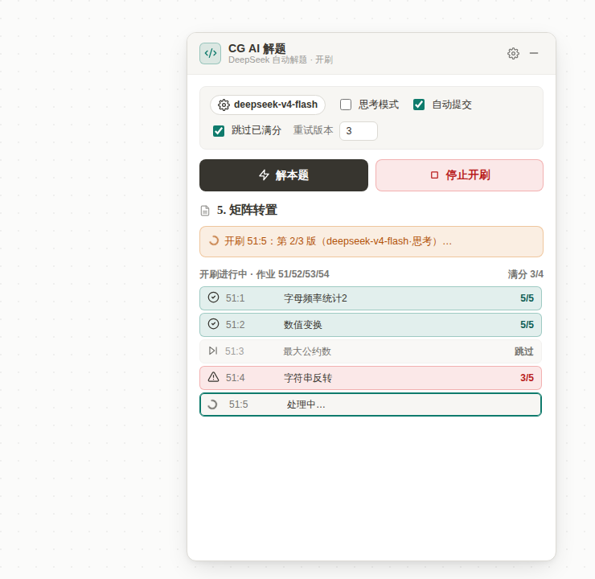

# CourseGrading AI 自动解题助手（脚本猫 / 油猴脚本）

希冀（CourseGrading / educg）编程题平台的 AI 解题脚本：
**提取完整题目 → DeepSeek 生成 Java → 自动填表上传 → 轮询并显示判题结果**，并支持**一键串行开刷所有作业 / 所有题目、失败多版本重试、自动跳题**。

UI 参照 [Aurash](../Aurash/) 的 Notion 风格设计令牌（暖白底、近黑字、细描边、6/8/12 圆角、lucide 线性图标）。




## 安装

脚本猫 / Tampermonkey 里访问安装链接（**带 `?v=` 绕过 Cloudflare 缓存**）：

```
https://feiyue.selab.top/cg-ai-solver.user.js?v=2
```

> 裸链接 `…/cg-ai-solver.user.js` 会被 Cloudflare 边缘缓存（默认 4h TTL），更新后短时间内可能拿到旧版本——装新版请用带 `?v=` 的链接，或在 Cloudflare 给该路径加一条 Bypass Cache 规则。
> 首次运行脚本猫会提示「允许跨域连接」到 API 域名，**必须点允许**，否则请求会一直挂起。

## 使用

1. 打开任意编程题页（或希冀任意页）：右下角出现 **CG AI 解题** 面板。
2. 点齿轮 / 模型按钮进入**配置页**，填 **API Base URL**（默认 `https://api.deepseek.com`）、**API Key**、**主模型**（默认 `deepseek-v4-flash`）、可选**重试强模型**（`deepseek-v4-pro`）。Base URL 可换成任意 OpenAI 兼容服务。
3. **解本题**：当前题一键生成并提交，显示得分。
4. **一键开刷全部**：从第一题起串行解所有作业的所有题，自动提交、自动跳下一题；失败按「多版本」升级重试（flash → flash+思考 → 强模型）。可随时**停止开刷**。
5. 选项：思考模式（DeepSeek `thinking` 开关）、自动提交、跳过已满分、失败重试版本数。

## 文件

| 文件 | 说明 |
|---|---|
| `cg-ai-solver.user.js` | **主交付物**：脚本猫 / Tampermonkey 用户脚本 |
| `harden-nginx.sh` | 部署加固：把安装链接固定从 `~/public-scripts` 提供（独立于 Aurash 构建），含 `nginx -t` + 失败回滚 |
| `preview-gen.mjs` | 抽脚本 CSS 生成预览页（纯 node） |
| `test-extract.mjs` | jsdom 离线单测（18 项：提取 / 发现 / 队列推进 / 判分） |
| `gen.mjs` / `e2e.sh` | 端到端验证（jsdom 提取 + 真实 LLM + 真实提交），需 WSL fixtures，凭据走 `CG_USER`/`CG_PASS` 环境变量 |

> 仓库内不含任何账号或 API Key。

## 工作原理（已验证接口契约）

- **题目提取**：DOM `.col-10` 内、面包屑与首个 `<hr>` 之间取标题+题面；`problemID` 取自 `#showmessageFrame` 的 `src`；作业/题目列表从页面链接发现。
- **生成**：`POST <BaseURL>/chat/completions`，`max_tokens=8192`、`temperature=0`；DeepSeek 端点附带 `thinking:{type:enabled|disabled}`（v4 是推理模型，token 给不足会导致 `content` 为空）。
- **提交**：`DataTransfer` 写入页面真实文件框 `#CGFILE` + 填主类名，触发原生 `filesubmit()`（自动带 `wtime`/cookie/Referer，multipart 传 `FILE1`）。
- **判题**：轮询 `GET longtimerunJSON.jsp?assignID&problemID`，GBK 用 `TextDecoder('gbk')` 解码。
- **开刷**：跨页状态机，进度存 `GM_setValue`，每页 `location` 跳下一题后自动续跑。

## 限制

- 仅适配 Java 课程（平台锁定 `progLanguage=java`）。
- 题面纯文本提取，**图片描述**的题目模型看不到。
- 生成代码强制 ASCII；需中文输出的题需手动处理。
- 浏览器必须能访问所配 API 域名（脚本会显示「已用时 Ns」与连接失败原因，便于排查）。
